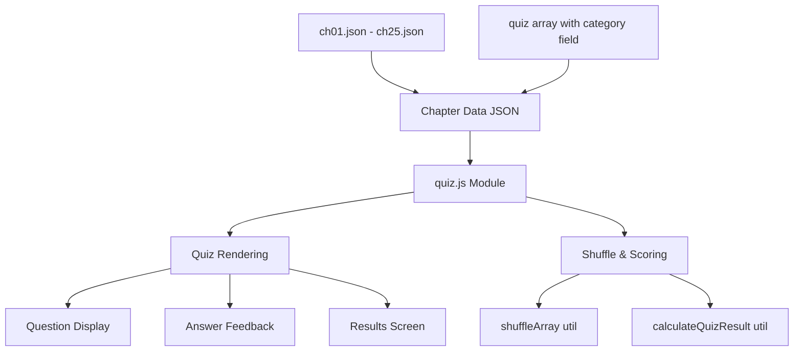

# Dokumen Desain Teknis: JLPT N5 Quiz Enhancement

## Overview

Fitur ini menambahkan kuis bergaya JLPT N5 yang lebih komprehensif untuk semua 25 bab dalam aplikasi flashcard Minna no Nihongo. Kuis saat ini hanya memiliki 10 soal dasar per bab. Enhancement ini akan menambahkan 15-20 soal JLPT N5 per bab dengan format yang mengikuti struktur ujian JLPT N5 resmi, mencakup tiga kategori: **Vocabulary** (40%), **Grammar** (40%), dan **Reading Comprehension** (20%).

Fitur ini dirancang untuk **backward compatible** dengan modul quiz.js yang sudah ada — tidak ada perubahan kode JavaScript yang diperlukan. Semua enhancement dilakukan melalui penambahan data JSON dengan field `category` baru yang opsional.

### Tujuan Desain

1. **Kompatibilitas penuh** dengan struktur aplikasi yang ada (vanilla JS, no framework, no build tool)
2. **Zero code changes** pada quiz.js — hanya penambahan data JSON
3. **Format soal JLPT N5 yang autentik** dengan distribusi kategori yang seimbang
4. **Relevansi materi** — setiap soal menggunakan vocabulary dan grammar dari bab yang sesuai
5. **Skalabilitas** — mudah menambah soal baru atau mengubah distribusi kategori

---

## Architecture

### High-Level Design



### Komponen yang Terpengaruh

| Komponen | Perubahan | Alasan |
|---|---|---|
| `data/ch{N}.json` | **Modifikasi** — tambah soal JLPT N5 dengan field `category` | Menambah question pool per bab |
| `quiz.js` | **Tidak ada perubahan** | Struktur data kompatibel dengan interface yang ada |
| `utils.js` | **Tidak ada perubahan** | Fungsi shuffle dan scoring sudah mendukung |
| `data.js` | **Tidak ada perubahan** | Fetch logic tidak berubah |

### Backward Compatibility Strategy

- Field `category` bersifat **opsional** — soal lama tanpa field ini tetap berfungsi
- Modul quiz.js tidak perlu tahu tentang kategori soal (kecuali fitur opsional diaktifkan)
- Struktur `QuizQuestion` tetap sama, hanya ditambah field opsional
- Fungsi `shuffleArray` dan `calculateQuizResult` bekerja pada semua soal tanpa membedakan kategori

---

## Components and Interfaces

### Data Model Enhancement

#### QuizQuestion (Enhanced)

```javascript
/**
 * @typedef {Object} QuizQuestion
 * @property {string} id           - Unique ID, contoh: "ch01_q01"
 * @property {number} chapterId
 * @property {number} order
 * @property {string} question     - Teks pertanyaan (atau bacaan + pertanyaan untuk reading)
 * @property {string[]} choices    - Tepat 4 pilihan jawaban
 * @property {number} correctIndex - Index jawaban benar (0–3)
 * @property {string} [explanation] - Penjelasan opsional
 * @property {string} [category]   - "vocabulary" | "grammar" | "reading" (opsional, untuk soal JLPT N5)
 */
```

**Perubahan:**
- Tambah field `category` (opsional) untuk membedakan soal JLPT N5 dari soal dasar
- Soal lama (10 soal per bab) tidak memiliki field `category`
- Soal baru (15-20 soal JLPT N5) memiliki field `category`

### JSON Structure per Chapter

```json
{
  "chapter": { ... },
  "vocabulary": [ ... ],
  "patterns": [ ... ],
  "grammar": [ ... ],
  "quiz": [
    {
      "id": "ch01_q01",
      "chapterId": 1,
      "order": 1,
      "question": "Apa arti kata 'わたし' (watashi)?",
      "choices": ["kamu", "saya", "dia", "mereka"],
      "correctIndex": 1
    },
    {
      "id": "ch01_q11",
      "chapterId": 1,
      "order": 11,
      "question": "Bagaimana cara membaca kanji '私'?",
      "choices": ["あなた", "わたし", "かれ", "かのじょ"],
      "correctIndex": 1,
      "category": "vocabulary"
    },
    {
      "id": "ch01_q12",
      "chapterId": 1,
      "order": 12,
      "question": "Pilih partikel yang tepat: わたし___ がくせいです。",
      "choices": ["は", "が", "を", "に"],
      "correctIndex": 0,
      "category": "grammar"
    },
    {
      "id": "ch01_q13",
      "chapterId": 1,
      "order": 13,
      "question": "わたしは マイクです。がくせいです。\n\nマイクさんは だれですか。",
      "choices": ["せんせい", "がくせい", "かいしゃいん", "いしゃ"],
      "correctIndex": 1,
      "category": "reading"
    }
  ]
}
```

---

## Data Models

### Question Categories

#### 1. Vocabulary Questions (40%)

**Tipe soal vocabulary:**

**A. Kanji Reading** — Menguji kemampuan membaca kanji dengan hiragana yang benar
```json
{
  "id": "ch01_v01",
  "chapterId": 1,
  "order": 11,
  "question": "Bagaimana cara membaca kanji '私'?",
  "choices": ["あなた", "わたし", "かれ", "かのじょ"],
  "correctIndex": 1,
  "category": "vocabulary"
}
```

**B. Word Meaning** — Menguji pemahaman arti kata
```json
{
  "id": "ch01_v02",
  "chapterId": 1,
  "order": 12,
  "question": "Apa arti kata 'せんせい'?",
  "choices": ["pelajar", "karyawan", "guru/dokter", "dokter"],
  "correctIndex": 2,
  "category": "vocabulary"
}
```

**C. Contextual Usage** — Menguji penggunaan kata dalam konteks kalimat
```json
{
  "id": "ch01_v03",
  "chapterId": 1,
  "order": 13,
  "question": "Pilih kata yang tepat: わたしは ___です。(Saya adalah pelajar)",
  "choices": ["せんせい", "がくせい", "かいしゃいん", "いしゃ"],
  "correctIndex": 1,
  "category": "vocabulary"
}
```

#### 2. Grammar Questions (40%)

**Tipe soal grammar:**

**A. Particle Selection** — Menguji pemilihan partikel yang tepat
```json
{
  "id": "ch01_g01",
  "chapterId": 1,
  "order": 14,
  "question": "Pilih partikel yang tepat: わたし___ がくせいです。",
  "choices": ["は", "が", "を", "に"],
  "correctIndex": 0,
  "category": "grammar"
}
```

**B. Sentence Completion** — Menguji pelengkapan kalimat dengan pola grammar yang benar
```json
{
  "id": "ch01_g02",
  "chapterId": 1,
  "order": 15,
  "question": "Lengkapi kalimat: わたしは せんせい___ ありません。",
  "choices": ["です", "では", "でも", "でした"],
  "correctIndex": 1,
  "category": "grammar"
}
```

**C. Grammar Pattern Recognition** — Menguji identifikasi pola grammar
```json
{
  "id": "ch01_g03",
  "chapterId": 1,
  "order": 16,
  "question": "Pola grammar apa yang digunakan dalam 'サントスさんも がくせいです'?",
  "choices": ["N は N です", "N も N です", "N が N です", "N を N です"],
  "correctIndex": 1,
  "category": "grammar"
}
```

#### 3. Reading Comprehension Questions (20%)

**Format:** Bacaan pendek (2-4 kalimat) diikuti pertanyaan pemahaman

```json
{
  "id": "ch01_r01",
  "chapterId": 1,
  "order": 17,
  "question": "わたしは マイク・ミラーです。アメリカじんです。エンジニアです。\n\nミラーさんは なにじんですか。",
  "choices": ["にほんじん", "アメリカじん", "イギリスじん", "オーストラリアじん"],
  "correctIndex": 1,
  "category": "reading"
}
```

**Karakteristik reading questions:**
- Bacaan dan pertanyaan digabung dalam satu field `question` (dipisah dengan `\n\n`)
- Bacaan maksimal 50 karakter Jepang
- Menggunakan vocabulary dan grammar dari bab yang sama atau sebelumnya
- Menguji pemahaman isi, bukan hanya vocabulary atau grammar

### Distribution Formula

Untuk setiap bab dengan N soal JLPT N5 (15 ≤ N ≤ 20):

| Kategori | Persentase | Jumlah Soal (N=15) | Jumlah Soal (N=20) |
|---|---|---|---|
| Vocabulary | 40% | 6 soal | 8 soal |
| Grammar | 40% | 6 soal | 8 soal |
| Reading | 20% | 3 soal | 4 soal |

**Contoh distribusi untuk Bab 1 (20 soal JLPT N5):**
- Vocabulary: 8 soal (3 kanji reading + 3 word meaning + 2 contextual usage)
- Grammar: 8 soal (3 particle selection + 3 sentence completion + 2 pattern recognition)
- Reading: 4 soal (4 bacaan pendek dengan 1 pertanyaan masing-masing)

---

## Implementation Strategy

### Phase 1: Content Creation Guidelines

#### Prinsip Pembuatan Soal

1. **Relevansi Materi**
   - Vocabulary questions hanya menggunakan kata dari `vocabulary` array bab tersebut
   - Grammar questions hanya menggunakan pola dari `patterns` atau `grammar` array bab tersebut
   - Reading questions menggunakan kombinasi vocabulary dan grammar dari bab tersebut atau sebelumnya

2. **Tingkat Kesulitan N5**
   - Vocabulary: hanya kata dalam silabus JLPT N5
   - Grammar: hanya pola grammar level N5
   - Reading: kalimat sederhana, maksimal 50 karakter per bacaan

3. **Distractor Quality** (pilihan jawaban yang salah)
   - Harus masuk akal dan tidak terlalu mudah dibedakan
   - Menggunakan kata/pola yang mirip atau sering tertukar
   - Tidak ada duplikat dalam satu soal

#### Template Soal per Kategori

**Vocabulary - Kanji Reading:**
```
Question: "Bagaimana cara membaca kanji '{kanji}'?"
Choices: [wrong_reading_1, correct_reading, wrong_reading_2, wrong_reading_3]
```

**Vocabulary - Word Meaning:**
```
Question: "Apa arti kata '{kana/kanji}'?"
Choices: [wrong_meaning_1, correct_meaning, wrong_meaning_2, wrong_meaning_3]
```

**Vocabulary - Contextual Usage:**
```
Question: "Pilih kata yang tepat: {sentence_with_blank} ({indonesian_hint})"
Choices: [wrong_word_1, correct_word, wrong_word_2, wrong_word_3]
```

**Grammar - Particle Selection:**
```
Question: "Pilih partikel yang tepat: {sentence_with_blank}"
Choices: [wrong_particle_1, correct_particle, wrong_particle_2, wrong_particle_3]
```

**Grammar - Sentence Completion:**
```
Question: "Lengkapi kalimat: {sentence_with_blank}"
Choices: [wrong_form_1, correct_form, wrong_form_2, wrong_form_3]
```

**Grammar - Pattern Recognition:**
```
Question: "Pola grammar apa yang digunakan dalam '{example_sentence}'?"
Choices: [wrong_pattern_1, correct_pattern, wrong_pattern_2, wrong_pattern_3]
```

**Reading Comprehension:**
```
Question: "{passage_2_4_sentences}\n\n{comprehension_question}"
Choices: [wrong_answer_1, correct_answer, wrong_answer_2, wrong_answer_3]
```

### Phase 2: Data Population Strategy

#### Workflow untuk Membuat 15-20 Soal per Bab

1. **Analisis Materi Bab**
   - Baca `vocabulary`, `patterns`, dan `grammar` dari `ch{N}.json`
   - Identifikasi kata kunci dan pola grammar utama

2. **Buat Vocabulary Questions (6-8 soal)**
   - Pilih 3-4 kata dengan kanji untuk kanji reading questions
   - Pilih 2-3 kata penting untuk word meaning questions
   - Buat 1-2 kalimat konteks untuk contextual usage questions

3. **Buat Grammar Questions (6-8 soal)**
   - Pilih 3-4 pola grammar untuk particle selection questions
   - Buat 2-3 kalimat untuk sentence completion questions
   - Pilih 1-2 pola untuk pattern recognition questions

4. **Buat Reading Questions (3-4 soal)**
   - Tulis 3-4 bacaan pendek (2-4 kalimat) menggunakan vocabulary dan grammar bab tersebut
   - Buat 1 pertanyaan pemahaman per bacaan

5. **Validasi Soal**
   - Pastikan setiap soal memiliki tepat 4 choices
   - Pastikan correctIndex benar (0-3)
   - Pastikan tidak ada duplikat choices
   - Pastikan distractor masuk akal

6. **Numbering dan Ordering**
   - Soal lama (tanpa category): order 1-10
   - Soal JLPT N5: order 11-30
   - ID format: `ch{N}_q{order}` atau `ch{N}_v{order}`, `ch{N}_g{order}`, `ch{N}_r{order}`

#### Contoh Implementasi untuk Bab 1

```json
{
  "quiz": [
    // Soal lama (order 1-10) — tidak ada field category
    { "id": "ch01_q01", "order": 1, ... },
    { "id": "ch01_q02", "order": 2, ... },
    // ... hingga q10
    
    // Soal JLPT N5 Vocabulary (order 11-18)
    { "id": "ch01_v01", "order": 11, "category": "vocabulary", ... },
    { "id": "ch01_v02", "order": 12, "category": "vocabulary", ... },
    // ... 8 soal vocabulary
    
    // Soal JLPT N5 Grammar (order 19-26)
    { "id": "ch01_g01", "order": 19, "category": "grammar", ... },
    { "id": "ch01_g02", "order": 20, "category": "grammar", ... },
    // ... 8 soal grammar
    
    // Soal JLPT N5 Reading (order 27-30)
    { "id": "ch01_r01", "order": 27, "category": "reading", ... },
    { "id": "ch01_r02", "order": 28, "category": "reading", ... },
    // ... 4 soal reading
  ]
}
```

### Phase 3: Validation Checklist

Sebelum commit data JSON, validasi setiap bab:

- [ ] Total soal per bab: 25-30 soal (10 lama + 15-20 JLPT N5)
- [ ] Distribusi kategori: ~40% vocabulary, ~40% grammar, ~20% reading
- [ ] Setiap soal memiliki field wajib: id, chapterId, order, question, choices, correctIndex
- [ ] Soal JLPT N5 memiliki field category
- [ ] Setiap choices array memiliki tepat 4 elemen
- [ ] correctIndex dalam rentang 0-3
- [ ] Tidak ada duplikat choices dalam satu soal
- [ ] Vocabulary hanya dari bab tersebut
- [ ] Grammar hanya dari bab tersebut atau sebelumnya
- [ ] Reading maksimal 50 karakter Jepang per bacaan

---

## Error Handling

### Validation Errors

| Error | Penanganan |
|---|---|
| Soal tanpa field wajib | Skip soal tersebut, log warning di console |
| choices.length !== 4 | Skip soal tersebut, log warning |
| correctIndex di luar rentang 0-3 | Skip soal tersebut, log warning |
| category tidak valid | Treat sebagai soal tanpa kategori |

### Runtime Errors

| Skenario | Penanganan |
|---|---|
| Data quiz kosong atau tidak ada | Tampilkan pesan "Kuis untuk bab ini belum tersedia." |
| Fetch JSON gagal | Tampilkan pesan error dengan tombol "Coba Lagi" |
| Soal tidak valid saat render | Skip soal tersebut, lanjut ke soal berikutnya |

**Catatan:** Modul quiz.js sudah menangani error ini dengan baik, tidak perlu perubahan.

---

## Testing Strategy

### Manual Testing Checklist

**Data Validation:**
- [ ] Setiap bab memiliki 15-20 soal JLPT N5
- [ ] Distribusi kategori sesuai (40% vocab, 40% grammar, 20% reading)
- [ ] Semua soal memiliki struktur JSON yang valid
- [ ] Tidak ada duplikat ID soal

**Functional Testing:**
- [ ] Soal JLPT N5 muncul saat kuis dimulai
- [ ] Soal dapat diacak dengan tombol "Acak"
- [ ] Jawaban benar/salah ditampilkan dengan warna yang tepat
- [ ] Skor dihitung dengan benar (termasuk soal JLPT N5)
- [ ] Tombol "Ulangi Kuis" mengacak semua soal (lama + baru)

**Content Quality Testing:**
- [ ] Vocabulary questions relevan dengan materi bab
- [ ] Grammar questions menggunakan pola yang diajarkan di bab tersebut
- [ ] Reading questions menggunakan vocabulary dan grammar yang sudah dipelajari
- [ ] Distractor (pilihan salah) masuk akal dan tidak terlalu mudah
- [ ] Tingkat kesulitan sesuai JLPT N5

### Automated Validation Script (Optional)

Buat script Node.js sederhana untuk validasi struktur JSON:

```javascript
// validate-quiz.js
const fs = require('fs');

for (let i = 1; i <= 25; i++) {
  const data = JSON.parse(fs.readFileSync(`data/ch${String(i).padStart(2, '0')}.json`));
  const quiz = data.quiz || [];
  
  // Validasi jumlah soal
  const jlptQuestions = quiz.filter(q => q.category);
  console.log(`Bab ${i}: ${jlptQuestions.length} soal JLPT N5`);
  
  // Validasi distribusi kategori
  const vocab = jlptQuestions.filter(q => q.category === 'vocabulary').length;
  const grammar = jlptQuestions.filter(q => q.category === 'grammar').length;
  const reading = jlptQuestions.filter(q => q.category === 'reading').length;
  console.log(`  Vocab: ${vocab}, Grammar: ${grammar}, Reading: ${reading}`);
  
  // Validasi struktur soal
  quiz.forEach(q => {
    if (!q.id || !q.question || !q.choices || q.choices.length !== 4 || q.correctIndex < 0 || q.correctIndex > 3) {
      console.error(`  ERROR: Soal ${q.id} tidak valid`);
    }
  });
}
```

### Unit Testing (Optional)

Karena tidak ada perubahan kode JavaScript, unit testing tidak diperlukan. Namun jika ingin menambahkan fitur filter kategori di masa depan, bisa menambahkan test untuk fungsi filter:

```javascript
// Test untuk fungsi filterByCategory (jika diimplementasikan)
function filterByCategory(questions, category) {
  if (!category || category === 'all') return questions;
  return questions.filter(q => q.category === category);
}

// Test cases:
// - filterByCategory(questions, 'vocabulary') returns only vocab questions
// - filterByCategory(questions, 'all') returns all questions
// - filterByCategory(questions, null) returns all questions
```

---

## Future Enhancements (Optional Features)

### 1. Category Display

Menampilkan label kategori di atas pertanyaan:

```javascript
// Tambahan di quiz.js (opsional)
if (q.category) {
  const categoryLabel = document.createElement('span');
  categoryLabel.className = 'text-xs font-semibold text-indigo-600 uppercase';
  categoryLabel.textContent = q.category;
  wrapper.appendChild(categoryLabel);
}
```

### 2. Category Filter

Menambahkan tombol filter untuk memilih kategori soal:

```javascript
// Tambahan di quiz.js (opsional)
function renderCategoryFilter() {
  const filters = ['all', 'vocabulary', 'grammar', 'reading'];
  // Render tombol filter
  // Update questions array berdasarkan filter yang dipilih
}
```

### 3. Category Statistics

Menampilkan statistik per kategori di halaman hasil:

```javascript
// Tambahan di calculateQuizResult (opsional)
function calculateCategoryStats(questions, selectedAnswers) {
  const stats = { vocabulary: 0, grammar: 0, reading: 0 };
  questions.forEach((q, i) => {
    if (q.category && selectedAnswers[i] === q.correctIndex) {
      stats[q.category]++;
    }
  });
  return stats;
}
```

---

## Appendix: Example Questions

### Bab 1 - Example JLPT N5 Questions

**Vocabulary (8 soal):**

1. Kanji Reading: "Bagaimana cara membaca kanji '私'?" → わたし
2. Kanji Reading: "Bagaimana cara membaca kanji '先生'?" → せんせい
3. Kanji Reading: "Bagaimana cara membaca kanji '学生'?" → がくせい
4. Word Meaning: "Apa arti kata 'かいしゃいん'?" → karyawan perusahaan
5. Word Meaning: "Apa arti kata 'けんきゅうしゃ'?" → peneliti
6. Contextual Usage: "Pilih kata yang tepat: わたしは ___です。(Saya adalah guru)" → せんせい
7. Contextual Usage: "Pilih kata yang tepat: あのひとは ___です。(Orang itu adalah dokter)" → いしゃ
8. Word Meaning: "Apa arti sufiks '〜じん'?" → orang berkebangsaan ~

**Grammar (8 soal):**

1. Particle Selection: "Pilih partikel yang tepat: わたし___ がくせいです。" → は
2. Particle Selection: "Pilih partikel yang tepat: サントスさん___ がくせいです。" → も
3. Sentence Completion: "Lengkapi kalimat: わたしは せんせい___ ありません。" → では
4. Sentence Completion: "Lengkapi kalimat: ミラーさんは がくせい___か。" → です
5. Pattern Recognition: "Pola grammar apa yang digunakan dalam 'わたしは マイクです'?" → N は N です
6. Pattern Recognition: "Pola grammar apa yang digunakan dalam 'サントスさんも がくせいです'?" → N も N です
7. Sentence Completion: "Bentuk negatif dari 'です' adalah..." → では ありません
8. Particle Selection: "Partikel apa yang menandai kalimat tanya?" → か

**Reading (4 soal):**

1. "わたしは マイク・ミラーです。アメリカじんです。エンジニアです。\n\nミラーさんは なにじんですか。" → アメリカじん

2. "サントスさんは がくせいです。ブラジルじんです。\n\nサントスさんの しごとは なんですか。" → がくせい

3. "あのひとは たなかせんせいです。にほんじんです。だいがくの せんせいです。\n\nたなかさんは どこで はたらきますか。" → だいがく

4. "わたしは マリアです。がくせいでは ありません。かいしゃいんです。\n\nマリアさんは がくせいですか。" → いいえ、かいしゃいんです

---

## Summary

Fitur JLPT N5 Quiz Enhancement menambahkan 15-20 soal bergaya JLPT N5 per bab dengan distribusi: 40% vocabulary, 40% grammar, 20% reading. Implementasi dilakukan melalui penambahan data JSON dengan field `category` opsional, tanpa perubahan kode JavaScript. Modul quiz.js yang ada sudah kompatibel dengan struktur data baru ini.

**Key Design Decisions:**
- Zero code changes — backward compatible
- Category field is optional — old questions still work
- Content-driven approach — focus on quality question creation
- Scalable — easy to add more questions or adjust distribution
- JLPT N5 authentic format — prepares users for real exam

