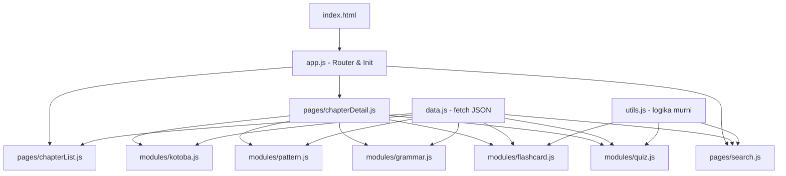

# Dokumen Desain Teknis: Minna no Nihongo Flashcard

## Overview

Aplikasi flashcard interaktif berbasis web untuk mempelajari bahasa Jepang menggunakan buku Minna no Nihongo 1 (edisi kedua) sebagai referensi materi. Aplikasi ini dibangun sebagai Single Page Application (SPA) menggunakan **native HTML + vanilla JavaScript (ES Modules)** tanpa framework, tanpa build tool, dan tanpa TypeScript.

Aplikasi mencakup 25 bab dengan lima modul per bab:
- **Kotoba** — daftar kosakata lengkap dengan kanji, kana, romaji, kelas kata, dan arti
- **Pola Kalimat** — struktur gramatikal beserta penjelasan dan contoh kalimat
- **Materi** — catatan tata bahasa tambahan: partikel, poin gramatikal, dan catatan penggunaan
- **Flashcard** — kartu bolak-balik interaktif untuk menghafal kosakata
- **Kuis** — soal pilihan ganda untuk mengukur pemahaman

Seluruh data materi disimpan sebagai file JSON statis yang di-fetch dengan `fetch()` API, sehingga aplikasi dapat berjalan secara offline setelah dimuat pertama kali.

---

## Architecture

Aplikasi menggunakan arsitektur **hash-based SPA** dengan vanilla JavaScript ES Modules. Tidak ada framework, tidak ada build step — file langsung dibuka di browser atau di-serve dengan server statis sederhana.



### Keputusan Arsitektur

| Keputusan | Pilihan | Alasan |
|---|---|---|
| Framework UI | Tidak ada (vanilla JS) | Kesederhanaan, tidak perlu build tool, langsung jalan di browser |
| Routing | Hash-based (`#/`, `#/chapter/1`) | Tidak perlu server-side routing, bekerja dengan file statis |
| State Management | Variabel modul lokal + DOM | Scope state per modul, cukup untuk aplikasi ini |
| Data Storage | JSON statis + `fetch()` | Materi buku bersifat tetap, tidak perlu database |
| Styling | Tailwind CSS via CDN | Utility-first, tidak perlu build step |
| Build Tool | Tidak ada | File langsung dibuka di browser |
| Bahasa | JavaScript (ES Modules) + JSDoc | Tidak perlu kompilasi, JSDoc untuk dokumentasi tipe |

### Mekanisme Routing

Routing menggunakan `window.location.hash` dan event `hashchange`:

```
#/                  → halaman daftar bab
#/chapter/1         → halaman detail Bab 1
#/chapter/25        → halaman detail Bab 25
```

`app.js` mendengarkan event `hashchange` dan `DOMContentLoaded`, lalu memanggil fungsi render halaman yang sesuai berdasarkan hash saat ini.

---

## Components and Interfaces

### Struktur File

```
index.html              ← entry point utama, memuat Tailwind CDN dan app.js
js/
  app.js                ← router dan inisialisasi aplikasi
  data.js               ← fungsi fetch data JSON + fetchAllChaptersData untuk pencarian
  utils.js              ← shuffleArray, calculateQuizResult, navigasi flashcard, filterSearch
  pages/
    chapterList.js      ← render halaman daftar bab + kotak pencarian global
    chapterDetail.js    ← render halaman detail bab + tab navigasi modul (5 tab)
  modules/
    kotoba.js           ← modul kosakata (kanji + kana terpisah)
    pattern.js          ← modul pola kalimat
    grammar.js          ← modul materi/catatan tata bahasa
    flashcard.js        ← modul flashcard
    quiz.js             ← modul kuis
data/
  chapters.json         ← metadata 25 bab
  ch01.json             ← data lengkap Bab 1
  ...
  ch25.json             ← data lengkap Bab 25
```

### Tanggung Jawab Setiap Modul JS

**`app.js`** — Router utama
- Mendengarkan `hashchange` dan `DOMContentLoaded`
- Mem-parse hash URL dan memanggil fungsi render yang sesuai
- Menginisialisasi aplikasi

**`data.js`** — Layer data
- `fetchChapters()` — fetch `data/chapters.json`
- `fetchChapterData(chapterId)` — fetch `data/ch{id}.json`
- Menangani error fetch dan mengembalikan `null` jika gagal

**`utils.js`** — Logika bisnis murni
- `shuffleArray(arr)` — Fisher-Yates shuffle, mengembalikan array baru
- `calculateQuizResult(questions, selectedAnswers)` — menghitung skor kuis
- `getNextIndex(currentIndex, total)` — navigasi siklik ke depan
- `getPrevIndex(currentIndex, total)` — navigasi siklik ke belakang

**`pages/chapterList.js`** — Halaman daftar bab
- `renderChapterList(container)` — fetch dan render 25 kartu bab ke dalam `container`
- Render kotak pencarian global di bagian atas halaman
- Mengelola state pencarian: `searchQuery`, `searchResults`

**`pages/chapterDetail.js`** — Halaman detail bab
- `renderChapterDetail(container, chapterId)` — render tab navigasi dan konten modul aktif
- Mengelola state `activeModule` dan perpindahan tab (5 tab: Kotoba, Pola Kalimat, Materi, Flashcard, Kuis)

**`modules/kotoba.js`** — Modul kosakata
- `renderKotoba(container, chapterData)` — render daftar kosakata dengan kanji dan kana sebagai field terpisah

**`modules/pattern.js`** — Modul pola kalimat
- `renderPattern(container, chapterData)` — render daftar pola kalimat

**`modules/grammar.js`** — Modul materi/catatan tata bahasa
- `renderGrammar(container, chapterData)` — render daftar catatan tata bahasa per bab

**`modules/flashcard.js`** — Modul flashcard
- `renderFlashcard(container, chapterData)` — render flashcard dengan state lokal
- Mengelola state: `cards`, `currentIndex`, `isFlipped`

**`modules/quiz.js`** — Modul kuis
- `renderQuiz(container, chapterData)` — render kuis dengan state lokal
- Mengelola state: `questions`, `currentIndex`, `selectedAnswers`, `isFinished`

### Pola Render

Setiap fungsi render menggunakan pola berikut:
```javascript
function renderKotoba(container, chapterData) {
  container.innerHTML = ''; // bersihkan konten sebelumnya
  // buat elemen DOM dan append ke container
}
```

---

## Data Models

### Model Bab (Chapter)

```javascript
/**
 * @typedef {Object} Chapter
 * @property {number} id           - Nomor bab (1–25)
 * @property {string} title        - Judul tema bab (bahasa Jepang)
 * @property {string} titleRomaji  - Transliterasi romaji judul
 * @property {string} titleId      - Terjemahan Bahasa Indonesia
 */
```

### Model Kosakata (Vocabulary)

```javascript
/**
 * @typedef {Object} VocabEntry
 * @property {string} id          - Unique ID, contoh: "ch01_001"
 * @property {number} chapterId   - Nomor bab
 * @property {number} order       - Urutan dalam bab (sesuai buku)
 * @property {string} kanji       - Tulisan kanji (contoh: "食べる"), kosong string jika tidak ada kanji
 * @property {string} kana        - Tulisan kana/hiragana/katakana (contoh: "たべる"), selalu diisi
 * @property {string} romaji      - Transliterasi romaji Hepburn
 * @property {string} wordClass   - Kelas kata (nomina, verba-i, dll.)
 * @property {string} meaning     - Arti dalam Bahasa Indonesia
 */
```

Nilai valid untuk `wordClass`: `'nomina'`, `'verba-i'`, `'verba-ru'`, `'verba-ireguler'`, `'adjektiva-i'`, `'adjektiva-na'`, `'adverbia'`, `'partikel'`, `'konjungsi'`, `'ekspresi'`, `'prefiks'`, `'sufiks'`

### Model Pola Kalimat (Sentence Pattern)

```javascript
/**
 * @typedef {Object} PatternExample
 * @property {string} japanese    - Kalimat dalam kanji/kana
 * @property {string} romaji      - Transliterasi romaji
 * @property {string} indonesian  - Terjemahan Bahasa Indonesia
 */

/**
 * @typedef {Object} SentencePattern
 * @property {string} id              - Unique ID, contoh: "ch01_p01"
 * @property {number} chapterId
 * @property {number} order
 * @property {string} pattern         - Struktur pola (contoh: "N は N です")
 * @property {string} explanation     - Penjelasan dalam Bahasa Indonesia
 * @property {PatternExample[]} examples
 */
```

### Model Soal Kuis (Quiz Question)

```javascript
/**
 * @typedef {Object} QuizQuestion
 * @property {string} id           - Unique ID, contoh: "ch01_q01"
 * @property {number} chapterId
 * @property {number} order
 * @property {string} question     - Teks pertanyaan
 * @property {string[]} choices    - Tepat 4 pilihan jawaban
 * @property {number} correctIndex - Index jawaban benar (0–3)
 * @property {string} [explanation] - Penjelasan opsional
 */
```

### Model Data Per Bab (Chapter Data Bundle)

```javascript
/**
 * @typedef {Object} ChapterData
 * @property {Chapter} chapter
 * @property {VocabEntry[]} vocabulary
 * @property {SentencePattern[]} patterns
 * @property {GrammarNote[]} grammar
 * @property {QuizQuestion[]} quiz
 */
```

### Model Catatan Tata Bahasa (Grammar Note)

```javascript
/**
 * @typedef {Object} GrammarExample
 * @property {string} japanese    - Kalimat dalam kanji/kana
 * @property {string} romaji      - Transliterasi romaji
 * @property {string} indonesian  - Terjemahan Bahasa Indonesia
 */

/**
 * @typedef {Object} GrammarNote
 * @property {string} id              - Unique ID, contoh: "ch01_g01"
 * @property {number} chapterId
 * @property {number} order
 * @property {string} title           - Judul poin gramatikal (contoh: "Partikel は (wa)")
 * @property {string} explanation     - Penjelasan dalam Bahasa Indonesia
 * @property {GrammarExample[]} examples
 */
```

### Model Hasil Pencarian (Search Result)

```javascript
/**
 * @typedef {Object} VocabSearchResult
 * @property {'vocab'} type
 * @property {number} chapterId
 * @property {VocabEntry} item
 */

/**
 * @typedef {Object} PatternSearchResult
 * @property {'pattern'} type
 * @property {number} chapterId
 * @property {SentencePattern} item
 */

/**
 * @typedef {VocabSearchResult | PatternSearchResult} SearchResult
 */
```

### Struktur File Data

```
data/
├── chapters.json          // Array of Chapter (25 bab)
├── ch01.json              // ChapterData Bab 1
├── ch02.json              // ChapterData Bab 2
...
└── ch25.json              // ChapterData Bab 25
```

### State Flashcard (variabel lokal di `flashcard.js`)

```javascript
// State dikelola sebagai variabel lokal dalam closure renderFlashcard()
let cards = [];          // VocabEntry[] — daftar kartu (bisa teracak)
let currentIndex = 0;    // indeks kartu saat ini
let isFlipped = false;   // true = sisi belakang terlihat
```

### State Kuis (variabel lokal di `quiz.js`)

```javascript
// State dikelola sebagai variabel lokal dalam closure renderQuiz()
let questions = [];          // QuizQuestion[] — soal (bisa teracak)
let currentIndex = 0;        // indeks soal saat ini
let selectedAnswers = [];    // (number|null)[] — jawaban pengguna per soal
let isFinished = false;      // true = semua soal selesai
```

---

## Correctness Properties

*A property is a characteristic or behavior that should hold true across all valid executions of a system — essentially, a formal statement about what the system should do. Properties serve as the bridge between human-readable specifications and machine-verifiable correctness guarantees.*

### Property 1: Navigasi bab selalu menghasilkan hash yang benar

*For any* chapter ID dalam rentang 1–25, mengklik kartu bab tersebut harus mengubah `window.location.hash` menjadi `#/chapter/{id}` yang sesuai.

**Validates: Requirements 1.2**

---

### Property 2: Setiap entri kosakata ditampilkan dengan informasi lengkap dan berurutan

*For any* array `VocabEntry[]` yang diberikan ke fungsi render Kotoba, semua entri harus dirender (jumlah elemen DOM yang dihasilkan sama dengan panjang array), setiap entri harus menampilkan field kana (selalu), kanji (jika tidak kosong), romaji, kelas kata, dan arti, serta urutan tampilan harus mengikuti field `order` secara ascending.

**Validates: Requirements 2.1, 2.2, 2.3**

---

### Property 3: Setiap pola kalimat ditampilkan dengan komponen lengkap

*For any* array `SentencePattern[]` yang diberikan ke fungsi render Pola Kalimat, semua pola harus dirender, setiap pola harus menampilkan struktur pola, penjelasan, dan minimal satu contoh kalimat, dan setiap contoh kalimat harus menampilkan tiga representasi (Jepang, romaji, Indonesia).

**Validates: Requirements 3.1, 3.2, 3.3**

---

### Property 4: Flip flashcard adalah operasi round-trip

*For any* nilai `isFlipped`, membalik kartu dua kali berturut-turut harus mengembalikan nilai `isFlipped` ke kondisi semula — yaitu `flip(flip(isFlipped)) === isFlipped`.

**Validates: Requirements 4.2, 4.3**

---

### Property 5: Navigasi flashcard bersifat siklik dan akurat

*For any* daftar flashcard dengan N kartu (N ≥ 1), memanggil `getNextIndex` sebanyak N kali dari indeks 0 harus mengembalikan `currentIndex` ke 0; dan untuk setiap posisi `currentIndex`, indikator yang ditampilkan harus menunjukkan `(currentIndex + 1) / N` secara tepat.

**Validates: Requirements 4.4, 4.5, 4.6, 4.7**

---

### Property 6: Operasi acak mempertahankan semua elemen

*For any* array (baik `VocabEntry[]` untuk flashcard maupun `QuizQuestion[]` untuk kuis), setelah `shuffleArray` dijalankan, array hasil harus mengandung elemen yang sama persis dengan array asal — tidak ada elemen yang hilang, tidak ada duplikat, hanya urutan yang berubah.

**Validates: Requirements 4.8, 5.6**

---

### Property 7: Setiap soal kuis memiliki struktur yang valid

*For any* `QuizQuestion`, array `choices` harus memiliki tepat 4 elemen, dan `correctIndex` harus berada dalam rentang `[0, 3]`.

**Validates: Requirements 5.2, 5.7**

---

### Property 8: Umpan balik kuis selalu mencerminkan kebenaran jawaban

*For any* soal kuis dan *for any* pilihan jawaban yang dipilih pengguna, umpan balik visual yang ditampilkan harus berwarna hijau jika dan hanya jika indeks pilihan sama dengan `correctIndex`, dan berwarna merah jika sebaliknya.

**Validates: Requirements 5.3**

---

### Property 9: Skor kuis dihitung dengan benar

*For any* sesi kuis yang selesai dengan N soal dan K jawaban benar (0 ≤ K ≤ N), hasil dari `calculateQuizResult` harus menunjukkan `correctCount === K`, `totalQuestions === N`, dan `percentage === Math.round((K / N) * 100)`.

**Validates: Requirements 5.5**

---

### Property 10: Hanya satu tab modul yang aktif pada satu waktu

*For any* modul yang sedang aktif, hanya elemen tab modul tersebut yang boleh memiliki class CSS aktif; semua tab lainnya tidak boleh memiliki class aktif tersebut.

**Validates: Requirements 7.2, 7.3**

---

### Property 11: Hasil pencarian mencakup semua kecocokan yang relevan

*For any* kata kunci pencarian Q dan *for any* dataset dari 25 bab, fungsi pencarian harus mengembalikan semua entri kosakata yang field kanji, kana, romaji, atau meaning-nya mengandung Q (case-insensitive), dan semua pola kalimat yang field pattern atau explanation-nya mengandung Q — tidak ada hasil yang terlewat dan tidak ada hasil yang tidak relevan.

**Validates: Requirements 9.2, 9.3**

---

### Property 12: Setiap catatan tata bahasa ditampilkan dengan komponen lengkap

*For any* array `GrammarNote[]` yang diberikan ke fungsi render Materi, semua catatan harus dirender, setiap catatan harus menampilkan judul, penjelasan, dan minimal satu contoh kalimat dengan tiga representasi (Jepang, romaji, Indonesia).

**Validates: Requirements 8.1, 8.2, 8.3**

---

## Error Handling

### Skenario Error dan Penanganannya

| Skenario | Penanganan |
|---|---|
| Data kosakata bab tidak tersedia | Tampilkan pesan: "Kosakata untuk bab ini belum tersedia." |
| Data pola kalimat bab tidak tersedia | Tampilkan pesan: "Pola kalimat untuk bab ini belum tersedia." |
| Data materi bab tidak tersedia | Tampilkan pesan: "Materi untuk bab ini belum tersedia." |
| Data kuis bab tidak tersedia | Tampilkan pesan: "Kuis untuk bab ini belum tersedia." |
| Pencarian tidak menemukan hasil | Tampilkan pesan: "Tidak ada hasil untuk kata kunci tersebut." |
| Navigasi ke bab di luar rentang 1–25 | Redirect ke halaman daftar bab (`window.location.hash = '#/'`) |
| File JSON gagal di-fetch (network error) | Tampilkan pesan error generik dengan tombol "Coba Lagi" |

### Strategi Penanganan Error

- Setiap fungsi `fetch` dibungkus dengan `try/catch`
- Fungsi `fetchChapterData` mengembalikan `null` jika fetch gagal; pemanggil bertanggung jawab menampilkan pesan fallback
- Validasi `chapterId` dilakukan di `chapterDetail.js` sebelum fetch data
- Tidak ada global error boundary — setiap modul menangani errornya sendiri secara lokal

---

## Testing Strategy

### Pendekatan Pengujian

Karena tidak ada framework test yang di-bundle, pengujian dilakukan dengan dua cara:

1. **Manual testing** — membuka aplikasi di browser dan memverifikasi perilaku secara langsung
2. **Unit testing logika murni** — fungsi-fungsi di `utils.js` dapat diuji secara terpisah menggunakan Node.js atau browser console karena bersifat pure function

### Fungsi yang Dapat Diuji Secara Otomatis

Fungsi-fungsi berikut di `utils.js` adalah pure function dan dapat diuji tanpa DOM:

| Fungsi | Yang Diuji |
|---|---|
| `shuffleArray(arr)` | Hasil memiliki elemen yang sama, panjang sama, array asli tidak berubah |
| `calculateQuizResult(questions, answers)` | Skor benar untuk berbagai kombinasi jawaban |
| `getNextIndex(current, total)` | Navigasi siklik ke depan termasuk wrap-around |
| `getPrevIndex(current, total)` | Navigasi siklik ke belakang termasuk wrap-around |

### Checklist Manual Testing

**Halaman Daftar Bab:**
- [ ] 25 kartu bab ditampilkan
- [ ] Judul setiap bab sesuai dengan buku
- [ ] Klik kartu navigasi ke halaman detail bab yang benar

**Halaman Detail Bab:**
- [ ] Empat tab ditampilkan (Kotoba, Pola Kalimat, Flashcard, Kuis)
- [ ] Hanya satu tab aktif pada satu waktu
- [ ] Tombol kembali ke daftar bab berfungsi
- [ ] Perpindahan tab tidak memuat ulang halaman

**Modul Kotoba:**
- [ ] Semua kosakata bab ditampilkan dengan kanji, romaji, kelas kata, dan arti
- [ ] Urutan sesuai buku
- [ ] Pesan fallback muncul jika data kosong

**Modul Pola Kalimat:**
- [ ] Semua pola kalimat ditampilkan dengan struktur, penjelasan, dan contoh
- [ ] Setiap contoh memiliki tiga representasi
- [ ] Pesan fallback muncul jika data kosong

**Modul Flashcard:**
- [ ] Kartu pertama ditampilkan dengan sisi depan (kanji/kana)
- [ ] Klik kartu membalik ke sisi belakang (romaji + arti)
- [ ] Klik lagi membalik kembali ke sisi depan
- [ ] Tombol Berikutnya/Sebelumnya berfungsi dengan wrap-around
- [ ] Indikator posisi "X / N" akurat
- [ ] Tombol Acak mengubah urutan kartu

**Modul Kuis:**
- [ ] Soal ditampilkan satu per satu
- [ ] Pilihan jawaban benar diberi warna hijau, salah diberi warna merah
- [ ] Jawaban benar ditampilkan jika pengguna menjawab salah
- [ ] Halaman hasil menampilkan skor dan persentase
- [ ] Tombol Ulangi Kuis mengacak soal dan mereset state
- [ ] Pesan fallback muncul jika data kosong

### Validasi Data JSON

Sebelum deploy, validasi manual atau dengan script Node.js sederhana:
- Setiap `ch{N}.json` memiliki field `chapter`, `vocabulary`, `patterns`, `quiz`
- Setiap soal kuis memiliki tepat 4 `choices` dan `correctIndex` dalam rentang 0–3
- Setiap `VocabEntry` memiliki semua field wajib
