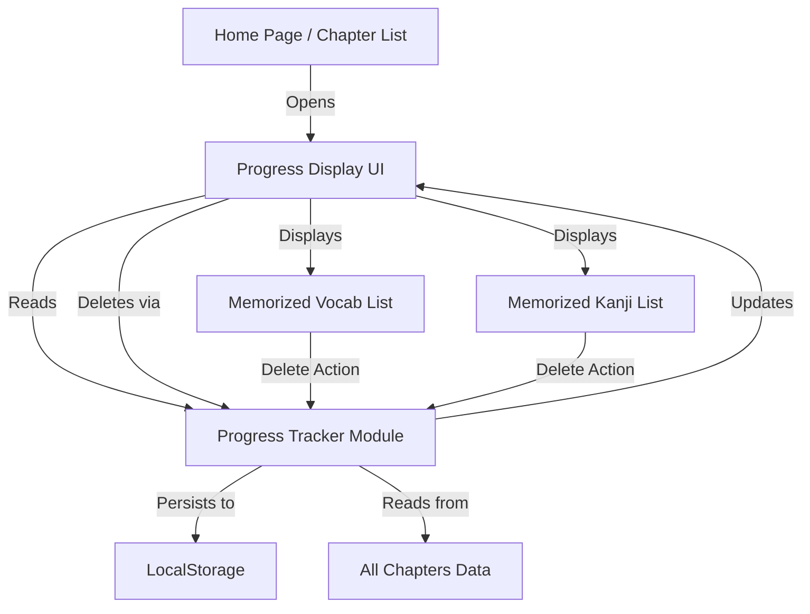

# Design Document: Progress Tracker Display & Delete

## Overview

This feature extends the existing Progress Tracker module to provide a comprehensive view of memorized vocabulary and kanji items, along with the ability to delete items from the memorized lists. The current implementation only displays aggregate statistics (counts and percentages) on the home page. This enhancement adds a dedicated UI component that displays the actual memorized items and allows users to manage their learning progress by removing items they want to practice again.

### Key Design Goals

1. **Visibility**: Provide clear, organized display of all memorized vocabulary and kanji items
2. **Manageability**: Enable users to remove items from their memorized lists with clear feedback
3. **Consistency**: Maintain data synchronization between UI, progress tracker, and localStorage
4. **Performance**: Ensure responsive UI updates and efficient data operations
5. **Integration**: Seamlessly integrate with existing progress tracker and home page UI

### Design Approach

The design follows a modular architecture with clear separation of concerns:
- **Data Layer**: Progress tracker module manages state and persistence
- **UI Layer**: New progress display component handles rendering and user interactions
- **Integration Layer**: Home page provides access point and coordinates between components

## Architecture

### System Components



### Component Responsibilities

#### 1. Progress Tracker Module (Existing - Enhanced)
- **Current Responsibilities**:
  - Track memorized vocabulary IDs in a Set
  - Track memorized kanji texts in a Set
  - Persist state to localStorage
  - Provide statistics (counts and percentages)
  - Mark items as memorized/forgotten

- **New Responsibilities**:
  - Provide methods to retrieve full lists of memorized items with details
  - Support deletion operations with proper state updates
  - Emit events or trigger callbacks for UI updates
  - Maintain data consistency during delete operations

#### 2. Progress Display UI Component (New)
- **Responsibilities**:
  - Render lists of memorized vocabulary and kanji items
  - Display item details (kanji, kana, romaji, meaning)
  - Provide delete buttons for each item
  - Handle delete confirmations and feedback
  - Update display in response to data changes
  - Show empty states when no items are memorized
  - Display current statistics alongside item lists

#### 3. Home Page Integration (Enhanced)
- **Responsibilities**:
  - Provide access point to Progress Display UI
  - Pass all chapters data to Progress Display UI
  - Coordinate navigation between views
  - Maintain existing progress statistics display

### Data Flow

#### Display Flow
1. User navigates to Progress Display UI from home page
2. Progress Display UI requests memorized items from Progress Tracker
3. Progress Tracker retrieves IDs from internal Sets
4. Progress Tracker looks up full item details from all chapters data
5. Progress Display UI renders items with details and delete buttons

#### Delete Flow
1. User clicks delete button on an item
2. Progress Display UI shows loading/processing state
3. Progress Display UI calls Progress Tracker delete method
4. Progress Tracker removes item from internal Set
5. Progress Tracker updates localStorage (batched, 100ms debounce)
6. Progress Tracker returns success/failure status
7. Progress Display UI updates display (removes item, updates stats)
8. Progress Display UI shows confirmation feedback

## Components and Interfaces

### Progress Tracker Module API Extensions

```javascript
class ProgressTracker {
  // Existing methods (unchanged)
  markVocabMemorized(vocabId)
  markVocabForgotten(vocabId)
  markKanjiMemorized(vocabId)
  markKanjiForgotten(vocabId)
  isVocabMemorized(vocabId)
  isKanjiMemorized(vocabId)
  getStats(allChaptersData)
  setChaptersData(allChaptersData)
  
  // New methods for display and delete functionality
  
  /**
   * Get all memorized vocabulary items with full details
   * @returns {Array<{id: string, kanji: string, kana: string, romaji: string, meaning: string, chapterId: number}>}
   */
  getMemorizedVocabList()
  
  /**
   * Get all memorized kanji items with full details
   * @returns {Array<{kanjiText: string, vocab: {id: string, kanji: string, kana: string, romaji: string, meaning: string}, chapterId: number}>}
   */
  getMemorizedKanjiList()
  
  /**
   * Delete vocabulary from memorized list
   * @param {string} vocabId - Vocabulary ID to delete
   * @returns {boolean} Success status
   */
  deleteMemorizedVocab(vocabId)
  
  /**
   * Delete kanji from memorized list
   * @param {string} kanjiText - Kanji text to delete
   * @returns {boolean} Success status
   */
  deleteMemorizedKanji(kanjiText)
}
```

### Progress Display UI Component

```javascript
/**
 * Render progress display UI with memorized items
 * @param {HTMLElement} container - Container element
 * @param {Array<ChapterData>} allChaptersData - All chapters data
 */
function renderProgressDisplay(container, allChaptersData)

/**
 * Render vocabulary list section
 * @param {HTMLElement} container - Container element
 * @param {Array} vocabList - List of memorized vocabulary items
 */
function renderVocabList(container, vocabList)

/**
 * Render kanji list section
 * @param {HTMLElement} container - Container element
 * @param {Array} kanjiList - List of memorized kanji items
 */
function renderKanjiList(container, kanjiList)

/**
 * Handle vocabulary delete action
 * @param {string} vocabId - Vocabulary ID to delete
 * @param {HTMLElement} itemElement - Item DOM element
 */
function handleVocabDelete(vocabId, itemElement)

/**
 * Handle kanji delete action
 * @param {string} kanjiText - Kanji text to delete
 * @param {HTMLElement} itemElement - Item DOM element
 */
function handleKanjiDelete(kanjiText, itemElement)

/**
 * Show delete confirmation feedback
 * @param {HTMLElement} itemElement - Item DOM element
 * @param {boolean} success - Whether deletion was successful
 */
function showDeleteFeedback(itemElement, success)
```

### Home Page Integration

The home page will be enhanced to provide access to the Progress Display UI:

```javascript
// Add button/link in progress statistics section
function renderProgressStats(container, allChaptersData) {
  // ... existing stats rendering ...
  
  // Add "View Details" button
  const viewDetailsButton = document.createElement('button');
  viewDetailsButton.textContent = 'Lihat Detail Progress';
  viewDetailsButton.className = 'mt-3 w-full px-4 py-2 bg-indigo-600 text-white rounded-lg hover:bg-indigo-700 text-sm font-medium transition-colors';
  viewDetailsButton.addEventListener('click', () => {
    window.location.hash = '#/progress';
  });
  container.appendChild(viewDetailsButton);
}
```

## Data Models

### Vocabulary Item Structure

```typescript
interface VocabItem {
  id: string;           // e.g., "ch01_001"
  kanji: string;        // e.g., "本" or ""
  kana: string;         // e.g., "ほん"
  romaji: string;       // e.g., "hon"
  meaning: string;      // e.g., "buku"
  chapterId: number;    // e.g., 1
}
```

### Kanji Item Structure

```typescript
interface KanjiItem {
  kanjiText: string;    // e.g., "本"
  vocab: VocabItem;     // Associated vocabulary item
  chapterId: number;    // e.g., 1
}
```

### Progress State Structure

```typescript
interface ProgressState {
  vocabMemorized: Set<string>;      // Set of vocabulary IDs
  kanjiMemorized: Set<string>;      // Set of kanji texts
  storageAvailable: boolean;        // Whether localStorage is available
  allChaptersData: ChapterData[];   // Reference to all chapters data
}
```

### LocalStorage Schema

```typescript
// Key: 'mnn_vocab_progress'
// Value: JSON array of vocabulary IDs
type VocabProgressData = string[];  // ["ch01_001", "ch01_002", ...]

// Key: 'mnn_kanji_progress'
// Value: JSON array of kanji texts
type KanjiProgressData = string[];  // ["本", "人", ...]
```

## Error Handling

### Error Scenarios and Handling

#### 1. LocalStorage Unavailable
- **Scenario**: Browser privacy settings or storage quota exceeded
- **Detection**: Try-catch around localStorage operations
- **Handling**: 
  - Set `storageAvailable = false`
  - Show warning message to user (already implemented)
  - Continue operation in memory-only mode
  - Display warning in Progress Display UI

#### 2. Delete Operation Failure
- **Scenario**: Item not found in Set or localStorage error
- **Detection**: Check return value from delete methods
- **Handling**:
  - Return `false` from delete method
  - Display error message in UI
  - Keep item in display
  - Log error to console

#### 3. Data Lookup Failure
- **Scenario**: Vocabulary ID exists in Set but not found in chapters data
- **Detection**: `_getVocabById()` returns `null`
- **Handling**:
  - Skip item in list rendering
  - Log warning to console
  - Continue rendering other items
  - Display count mismatch warning if significant

#### 4. Invalid Data Format
- **Scenario**: Corrupted localStorage data or invalid chapter data
- **Detection**: JSON parse errors or type validation failures
- **Handling**:
  - Reset to empty Set
  - Log warning to console
  - Display empty state in UI
  - Offer "Reset Progress" option

#### 5. Concurrent Modifications
- **Scenario**: Multiple delete operations in quick succession
- **Detection**: Track pending operations
- **Handling**:
  - Disable delete buttons during operation
  - Queue operations if needed
  - Use batched localStorage saves (already implemented)
  - Show loading state per item

### Error Messages

```javascript
const ERROR_MESSAGES = {
  DELETE_FAILED: 'Gagal menghapus item. Silakan coba lagi.',
  STORAGE_UNAVAILABLE: 'Penyimpanan tidak tersedia. Progress tidak akan tersimpan.',
  DATA_CORRUPTED: 'Data progress rusak. Silakan reset progress.',
  ITEM_NOT_FOUND: 'Item tidak ditemukan.',
  NETWORK_ERROR: 'Terjadi kesalahan. Silakan coba lagi.'
};
```

## Testing Strategy

### Unit Tests

#### Progress Tracker Module Tests
1. **Test `getMemorizedVocabList()`**
   - Returns empty array when no items memorized
   - Returns correct items with full details
   - Handles missing vocabulary IDs gracefully
   - Returns items sorted by chapter ID

2. **Test `getMemorizedKanjiList()`**
   - Returns empty array when no kanji memorized
   - Returns correct kanji with associated vocabulary
   - Handles missing kanji texts gracefully
   - Returns items sorted by chapter ID

3. **Test `deleteMemorizedVocab()`**
   - Successfully removes item from Set
   - Updates localStorage
   - Returns true on success
   - Returns false when item not found
   - Handles localStorage errors gracefully

4. **Test `deleteMemorizedKanji()`**
   - Successfully removes kanji from Set
   - Updates localStorage
   - Returns true on success
   - Returns false when kanji not found
   - Handles localStorage errors gracefully

5. **Test data consistency**
   - Deleting vocab doesn't affect kanji status
   - Deleting kanji doesn't affect vocab status
   - Stats update correctly after deletion
   - Can re-memorize deleted items

#### Progress Display UI Tests
1. **Test vocabulary list rendering**
   - Displays all memorized vocabulary items
   - Shows correct item details (kanji, kana, romaji, meaning)
   - Shows empty state when no items
   - Updates when new items added

2. **Test kanji list rendering**
   - Displays all memorized kanji items
   - Shows correct kanji and associated vocabulary
   - Shows empty state when no kanji
   - Updates when new kanji added

3. **Test delete functionality**
   - Delete button triggers delete operation
   - Shows loading state during deletion
   - Removes item from display on success
   - Shows error message on failure
   - Updates statistics after deletion

4. **Test user feedback**
   - Shows visual confirmation on successful delete
   - Shows error message on failed delete
   - Handles multiple rapid deletes correctly
   - Delete button has clear destructive styling

### Integration Tests
1. **Test end-to-end delete flow**
   - Delete vocab from display → updates localStorage → updates stats
   - Delete kanji from display → updates localStorage → updates stats
   - Navigate away and back → data persists correctly

2. **Test navigation integration**
   - Access Progress Display from home page
   - Return to home page → stats reflect changes
   - Navigate to chapter detail → can re-memorize deleted items

3. **Test data synchronization**
   - Changes in Progress Display reflect in home page stats
   - Changes in flashcard mode reflect in Progress Display
   - Multiple browser tabs maintain consistency (via localStorage events)

### Manual Testing Checklist
- [ ] Progress Display UI loads within 1000ms
- [ ] All memorized items display correctly
- [ ] Delete buttons are clearly visible and styled
- [ ] Delete operation completes within 500ms
- [ ] Visual feedback appears on delete
- [ ] Statistics update after delete
- [ ] Empty states display correctly
- [ ] Navigation works smoothly
- [ ] localStorage updates persist across page reloads
- [ ] Error messages display when appropriate
- [ ] UI remains responsive during operations
- [ ] Mobile responsive design works correctly

## Implementation Notes

### Performance Considerations

1. **Efficient List Rendering**
   - Use document fragments for batch DOM operations
   - Avoid unnecessary re-renders
   - Implement virtual scrolling if lists become very large (>100 items)

2. **Batched LocalStorage Updates**
   - Already implemented with 100ms debounce
   - Continue using this pattern for delete operations

3. **Cached Totals**
   - Already implemented in `getStats()`
   - Invalidate cache on delete operations

4. **Lazy Loading**
   - Load Progress Display UI only when accessed
   - Don't fetch all chapters data until needed

### UI/UX Considerations

1. **Visual Design**
   - Match existing Tailwind CSS styling
   - Use consistent color scheme (slate/indigo)
   - Ensure mobile responsiveness
   - Provide clear visual hierarchy

2. **Delete Button Design**
   - Use red color to indicate destructive action
   - Include trash icon for clarity
   - Position consistently (right side of item)
   - Adequate touch target size (min 44x44px)

3. **Feedback Mechanisms**
   - Immediate visual response on button click
   - Smooth fade-out animation on delete
   - Success confirmation (checkmark or toast)
   - Error messages in red with retry option

4. **Empty States**
   - Encouraging message for empty lists
   - Suggest starting with flashcard mode
   - Include illustration or icon

5. **Loading States**
   - Skeleton loaders for initial load
   - Spinner for delete operations
   - Disable interactions during loading

### Accessibility Considerations

1. **Keyboard Navigation**
   - All interactive elements keyboard accessible
   - Logical tab order
   - Enter/Space to activate buttons

2. **Screen Reader Support**
   - Proper ARIA labels for delete buttons
   - Announce delete confirmations
   - Descriptive text for empty states

3. **Visual Accessibility**
   - Sufficient color contrast (WCAG AA)
   - Don't rely solely on color for feedback
   - Clear focus indicators

### File Structure

```
js/
├── modules/
│   ├── progress.js (enhanced)
│   └── progressDisplay.js (new)
├── pages/
│   ├── chapterList.js (enhanced)
│   └── progressDetail.js (new)
└── app.js (enhanced with new route)
```

### Routing

Add new route to `app.js`:

```javascript
// In router function
if (hash === '#/progress') {
  const { renderProgressDetail } = await import('./pages/progressDetail.js');
  const allChaptersData = await fetchAllChaptersData();
  renderProgressDetail(app, allChaptersData);
  return;
}
```

## Future Enhancements

1. **Export Progress Data**
   - Export to JSON file
   - Import from JSON file
   - Share progress with others

2. **Progress History**
   - Track when items were memorized
   - Show learning timeline
   - Display progress charts

3. **Filtering and Sorting**
   - Filter by chapter
   - Sort by date memorized
   - Search within memorized items

4. **Batch Operations**
   - Select multiple items
   - Delete multiple items at once
   - Mark multiple as forgotten

5. **Undo Functionality**
   - Undo recent deletions
   - Restore accidentally deleted items
   - Time-limited undo buffer

6. **Cloud Sync**
   - Sync progress across devices
   - Backup to cloud storage
   - Restore from backup

