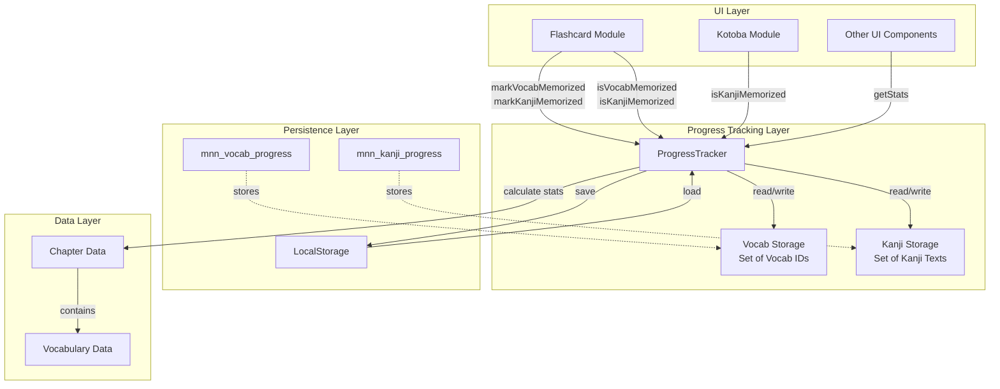
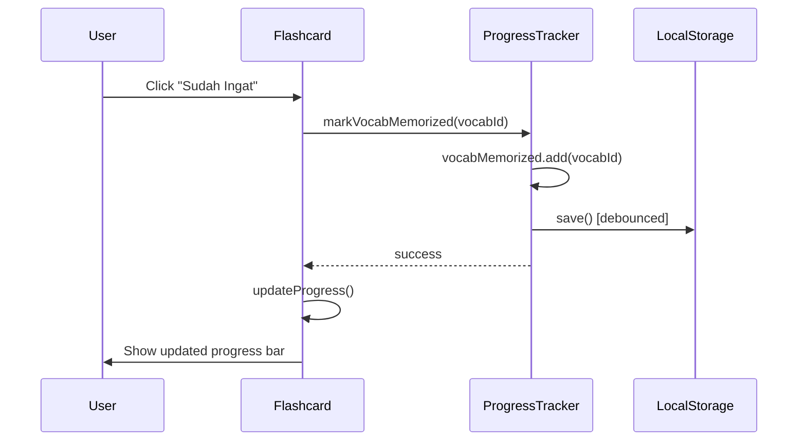
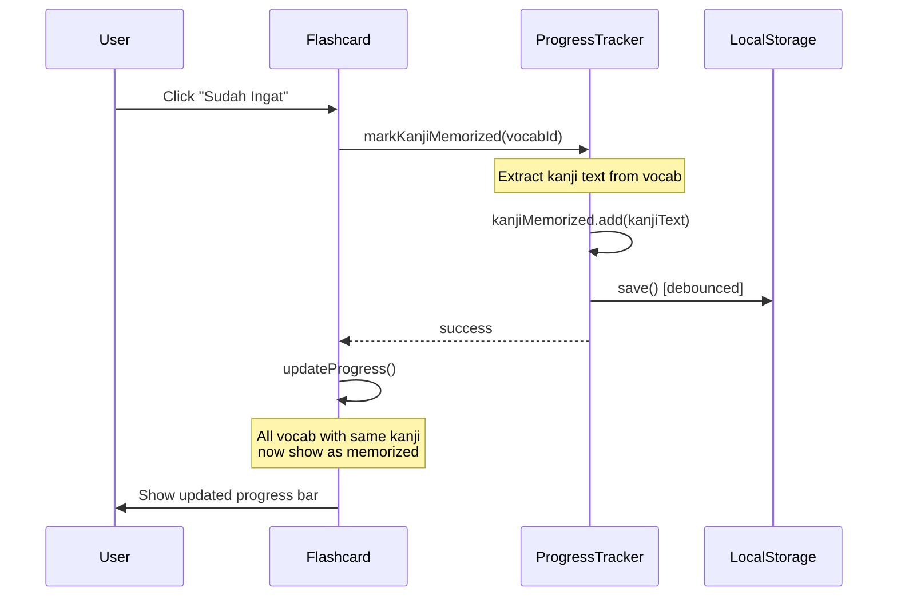
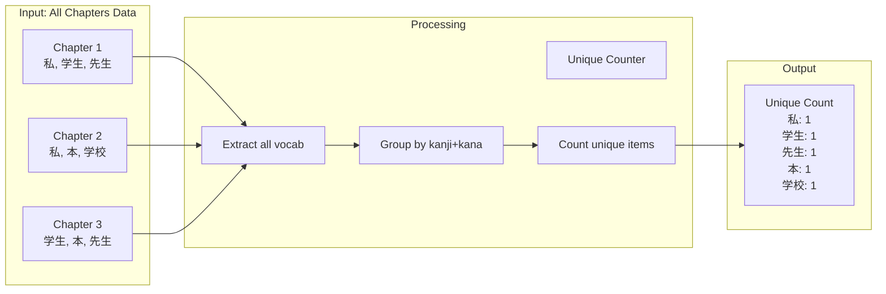

# Design Document: Unique Progress and Kanji Synchronization

## Overview

This design document specifies the technical implementation for enhancing the Minna no Nihongo learning application's progress tracking system with two key features:

1. **Unique Progress Counting**: Count vocabulary and kanji items only once across all chapters, eliminating duplicate counting when the same item appears in multiple chapters.
2. **Cross-Chapter Kanji Synchronization**: Synchronize kanji memorization status across all chapters based on kanji text rather than vocabulary ID.

### Current System Limitations

The existing `ProgressTracker` class has the following limitations:

- **Duplicate Counting**: When calculating overall statistics, the system counts every vocabulary item in every chapter, even if the same kanji appears multiple times across different chapters. For example, if "私" (watashi) appears in chapters 1, 3, and 5, it's counted three times in the total.
- **ID-Based Tracking**: Kanji memorization is tracked by vocabulary ID (e.g., "ch01_001", "ch03_015"), not by the actual kanji text. This means marking "私" as memorized in chapter 1 doesn't affect the same kanji in chapter 3.
- **Inconsistent User Experience**: Users must repeatedly mark the same kanji as memorized in different chapters, which doesn't reflect the reality that learning a kanji once applies everywhere.

### Design Goals

1. **Accurate Progress Metrics**: Provide users with realistic progress percentages based on unique vocabulary and kanji items
2. **Intelligent Synchronization**: Automatically sync kanji memorization across all chapters where the same kanji appears
3. **Dual Tracking System**: Maintain separate tracking for vocabulary (by ID) and kanji (by text) to support both "all" and "kanji" flashcard modes
4. **Backward Compatibility**: Preserve existing user progress data during the upgrade
5. **Performance**: Maintain fast lookup and update operations using efficient data structures

## Architecture

### High-Level Architecture



### Component Interaction Flow

#### Flashcard "All" Mode Flow


#### Flashcard "Kanji" Mode Flow


### Data Flow for Unique Counting



## Components and Interfaces

### ProgressTracker Class (Enhanced)

The `ProgressTracker` class is the core component that manages all progress tracking functionality.

#### Properties

```javascript
class ProgressTracker {
  // Existing properties
  vocabMemorized: Set<string>           // Set of vocab IDs (e.g., "ch01_001")
  kanjiMemorized: Set<string>           // NEW: Set of kanji texts (e.g., "私", "学生")
  storageAvailable: boolean
  storageWarningShown: boolean
  cachedTotals: { vocab: number, kanji: number } | null
  saveTimeout: number | null
}
```

#### Public Methods

```javascript
// Vocabulary tracking (by ID)
markVocabMemorized(vocabId: string): void
markVocabForgotten(vocabId: string): void
isVocabMemorized(vocabId: string): boolean

// Kanji tracking (by text) - ENHANCED
markKanjiMemorized(vocabId: string): void
markKanjiForgotten(vocabId: string): void
isKanjiMemorized(vocabId: string): boolean

// Statistics - ENHANCED
getStats(allChaptersData: ChapterData[]): ProgressStats

// Persistence
load(): void
save(): void
```

#### Method Specifications

##### `markKanjiMemorized(vocabId: string): void`

**Purpose**: Mark a kanji as memorized across all chapters where it appears.

**Algorithm**:
1. Look up the vocabulary item by `vocabId` in the chapter data
2. Extract the `kanji` field from the vocabulary item
3. If kanji is empty or contains no actual kanji characters, return early
4. Add the kanji text to `kanjiMemorized` Set
5. Trigger debounced save to localStorage

**Implementation Notes**:
- Must handle vocabulary items without kanji (hiragana/katakana only)
- Must validate that kanji text is non-empty before adding
- Uses Set for O(1) insertion

##### `isKanjiMemorized(vocabId: string): boolean`

**Purpose**: Check if a kanji is memorized by looking up its kanji text.

**Algorithm**:
1. Look up the vocabulary item by `vocabId` in the chapter data
2. Extract the `kanji` field from the vocabulary item
3. If kanji is empty or contains no actual kanji characters, return false
4. Check if the kanji text exists in `kanjiMemorized` Set
5. Return the result

**Implementation Notes**:
- Must handle vocabulary items without kanji gracefully
- Uses Set for O(1) lookup
- Returns false for non-kanji vocabulary

##### `getStats(allChaptersData: ChapterData[]): ProgressStats`

**Purpose**: Calculate overall progress statistics with unique counting.

**Algorithm**:
1. Validate input (must be array)
2. If cached totals exist, use them; otherwise:
   - Create a Map to track unique vocabulary by `kanji+kana` combination
   - Create a Set to track unique kanji texts
   - Iterate through all chapters and vocabulary items
   - For each vocabulary item:
     - Add to unique vocabulary Map using `${kanji}|${kana}` as key
     - If kanji exists and contains kanji characters, add to unique kanji Set
   - Cache the totals
3. Count memorized items:
   - For vocabulary: count items in `vocabMemorized` Set
   - For kanji: count items in `kanjiMemorized` Set
4. Calculate percentages
5. Return statistics object

**Return Type**:
```javascript
{
  vocab: {
    memorized: number,
    total: number,        // Unique count
    percentage: number
  },
  kanji: {
    memorized: number,
    total: number,        // Unique count
    percentage: number
  }
}
```

### Flashcard Module (Enhanced)

The flashcard module needs modifications to support the dual tracking system.

#### Changes Required

1. **Mode-Specific Memorization**:
   - In "all" mode: call `markVocabMemorized(vocabId)` / `markVocabForgotten(vocabId)`
   - In "kanji" mode: call `markKanjiMemorized(vocabId)` / `markKanjiForgotten(vocabId)`

2. **Mode-Specific Status Check**:
   - In "all" mode: call `isVocabMemorized(vocabId)`
   - In "kanji" mode: call `isKanjiMemorized(vocabId)`

3. **Progress Bar Update**:
   - Calculate progress based on current mode
   - In "kanji" mode: count how many cards have their kanji memorized
   - In "all" mode: count how many cards have their vocab ID memorized

#### Code Changes

```javascript
// In renderFlashcard function
function updateProgress() {
  const total = cards.length;
  
  const memorizedCount = mode === 'kanji' 
    ? cards.filter(v => progressTracker.isKanjiMemorized(v.id)).length
    : cards.filter(v => progressTracker.isVocabMemorized(v.id)).length;
  
  const pct = total > 0 ? Math.round((memorizedCount / total) * 100) : 0;
  
  // ... render progress bar
}

// In button event listeners
btnRemember.addEventListener('click', () => {
  const id = cards[currentIndex].id;
  if (mode === 'kanji') {
    progressTracker.markKanjiMemorized(id);
  } else {
    progressTracker.markVocabMemorized(id);
  }
  // ... rest of logic
});
```

### Kotoba Module (Enhanced)

The kotoba (vocabulary list) module needs to display memorization status for kanji vocabulary.

#### Changes Required

1. **Memorization Badge**: Add visual indicator for memorized kanji
2. **Status Check**: Check if kanji is memorized using `isKanjiMemorized(vocabId)`
3. **Conditional Display**: Only show badge for vocabulary items with kanji

#### Implementation

```javascript
function buildVocabCard(vocab) {
  const card = document.createElement('div');
  card.className = 'bg-slate-800 border border-slate-700 rounded-xl px-4 py-3 flex items-center gap-3';
  
  // Check if kanji is memorized
  const isMemorized = vocab.kanji && hasKanji(vocab.kanji) 
    ? progressTracker.isKanjiMemorized(vocab.id)
    : false;
  
  // Add memorization badge if memorized
  if (isMemorized) {
    const badge = document.createElement('span');
    badge.className = 'absolute top-2 right-2 text-xs bg-green-900/60 text-green-400 px-2 py-0.5 rounded-full';
    badge.textContent = '✓ Ingat';
    card.style.position = 'relative';
    card.appendChild(badge);
  }
  
  // ... rest of card building
}
```

## Data Models

### LocalStorage Schema

#### Vocabulary Progress (Existing)

**Key**: `mnn_vocab_progress`

**Format**: JSON array of vocabulary IDs

**Example**:
```json
[
  "ch01_001",
  "ch01_010",
  "ch02_005",
  "ch03_012"
]
```

#### Kanji Progress (New)

**Key**: `mnn_kanji_progress`

**Format**: JSON array of kanji text strings

**Example**:
```json
[
  "私",
  "学生",
  "先生",
  "本",
  "日本"
]
```

**Constraints**:
- Each kanji text must be a non-empty string
- Duplicate kanji texts are automatically handled by Set conversion
- Only actual kanji characters should be stored (no hiragana/katakana-only entries)

### In-Memory Data Structures

#### Vocabulary Memorization Set

```javascript
vocabMemorized: Set<string>
```

**Purpose**: Track which vocabulary items are memorized by their unique ID.

**Key Format**: Vocabulary ID (e.g., "ch01_001")

**Operations**:
- Add: O(1)
- Check: O(1)
- Delete: O(1)

#### Kanji Memorization Set

```javascript
kanjiMemorized: Set<string>
```

**Purpose**: Track which kanji are memorized by their text.

**Key Format**: Kanji text (e.g., "私", "学生")

**Operations**:
- Add: O(1)
- Check: O(1)
- Delete: O(1)

#### Unique Vocabulary Map (Temporary)

Used during statistics calculation to count unique vocabulary items.

```javascript
uniqueVocab: Map<string, VocabularyItem>
```

**Key Format**: `${kanji}|${kana}` (e.g., "私|わたし", "学生|がくせい")

**Purpose**: Deduplicate vocabulary items that appear in multiple chapters.

**Lifecycle**: Created during `getStats()`, discarded after calculation.

#### Unique Kanji Set (Temporary)

Used during statistics calculation to count unique kanji.

```javascript
uniqueKanji: Set<string>
```

**Key Format**: Kanji text (e.g., "私", "学生")

**Purpose**: Deduplicate kanji that appear in multiple vocabulary items across chapters.

**Lifecycle**: Created during `getStats()`, discarded after calculation.

### Vocabulary Item Structure

```typescript
interface VocabularyItem {
  id: string;           // e.g., "ch01_001"
  chapterId: number;    // e.g., 1
  order: number;        // e.g., 1
  kanji: string;        // e.g., "私" or "" for hiragana-only
  kana: string;         // e.g., "わたし"
  romaji: string;       // e.g., "watashi"
  wordClass: string;    // e.g., "nomina"
  meaning: string;      // e.g., "saya"
}
```

### Chapter Data Structure

```typescript
interface ChapterData {
  chapter: {
    id: number;
    title: string;
    titleRomaji: string;
    titleId: string;
  };
  vocabulary: VocabularyItem[];
  // ... other fields
}
```

## Error Handling

### Input Validation

1. **Invalid Chapter Data**:
   - **Condition**: `allChaptersData` is not an array
   - **Action**: Log error, return zero statistics
   - **User Impact**: Progress shows 0/0

2. **Missing Vocabulary Array**:
   - **Condition**: `chapterData.vocabulary` is not an array
   - **Action**: Skip chapter, log warning
   - **User Impact**: Chapter excluded from statistics

3. **Invalid Vocabulary Item**:
   - **Condition**: Vocabulary item is null or missing required fields
   - **Action**: Skip item, continue processing
   - **User Impact**: Item excluded from statistics

### LocalStorage Errors

1. **SecurityError**:
   - **Cause**: LocalStorage access blocked by browser security settings
   - **Action**: Set `storageAvailable = false`, show warning, continue with in-memory storage
   - **User Impact**: Progress not persisted between sessions

2. **QuotaExceededError**:
   - **Cause**: LocalStorage quota exceeded
   - **Action**: Set `storageAvailable = false`, show warning, continue with in-memory storage
   - **User Impact**: Progress not persisted between sessions

3. **Invalid JSON**:
   - **Cause**: Corrupted data in localStorage
   - **Action**: Reset to empty Set, log warning
   - **User Impact**: Progress reset for that data type

### Kanji Extraction Errors

1. **Empty Kanji Field**:
   - **Condition**: `vocab.kanji === ''` or `vocab.kanji === null`
   - **Action**: Treat as non-kanji vocabulary, track by vocab ID only
   - **User Impact**: Item tracked independently, no cross-chapter sync

2. **No Actual Kanji Characters**:
   - **Condition**: `vocab.kanji` contains only hiragana/katakana (e.g., "あなた")
   - **Action**: Treat as non-kanji vocabulary, track by vocab ID only
   - **User Impact**: Item tracked independently, no cross-chapter sync

### Error Recovery

All errors are handled gracefully with fallback behavior:
- Invalid data → Skip and continue
- Storage errors → Continue with in-memory storage
- Missing fields → Use default values

No errors should cause the application to crash or become unusable.

## Correctness Properties

*A property is a characteristic or behavior that should hold true across all valid executions of a system—essentially, a formal statement about what the system should do. Properties serve as the bridge between human-readable specifications and machine-verifiable correctness guarantees.*

### Property Reflection

After analyzing all acceptance criteria, I identified the following redundancies:

- **1.3 is redundant with 1.1**: Both test that duplicate vocabulary items are counted only once
- **2.5 is redundant with 2.1 and 2.2**: The synchronization invariant is already covered by the mark/unmark properties
- **3.3 is redundant with 2.1**: Cross-chapter sync in kanji mode is the same as the general kanji sync property
- **3.6 is redundant with 3.1**: Independence of tracking systems is already tested
- **10.2 is redundant with 6.5**: Caching behavior is already covered
- **10.3 is redundant with 4.6**: Debounce behavior is already covered

The following properties provide unique validation value and will be implemented:

### Property 1: Unique Vocabulary Counting

*For any* set of chapter data with vocabulary items, the count of unique vocabulary items (based on kanji+kana combination) SHALL be less than or equal to the sum of vocabulary counts across all chapters.

**Validates: Requirements 1.1, 1.3, 1.5**

### Property 2: Unique Kanji Counting

*For any* set of chapter data with vocabulary items, the count of unique kanji texts SHALL be less than or equal to the sum of kanji counts across all chapters.

**Validates: Requirements 1.2, 1.6**

### Property 3: Percentage Calculation Formula

*For any* memorized count and total count, the percentage SHALL equal `Math.round((memorized / total) * 100)`, and when total is zero, the percentage SHALL be 0.

**Validates: Requirements 1.4, 6.3, 6.4**

### Property 4: Cross-Chapter Kanji Synchronization (Memorize)

*For any* vocabulary items across multiple chapters with identical kanji text, marking the kanji as memorized for one vocabulary item SHALL result in all vocabulary items with that kanji text being marked as memorized.

**Validates: Requirements 2.1, 2.3, 2.5**

### Property 5: Cross-Chapter Kanji Synchronization (Forget)

*For any* vocabulary items across multiple chapters with identical kanji text, marking the kanji as forgotten for one vocabulary item SHALL result in all vocabulary items with that kanji text being marked as forgotten.

**Validates: Requirements 2.2, 2.5**

### Property 6: Kanji Lookup Consistency

*For any* two vocabulary items with identical kanji text, the memorization status returned by `isKanjiMemorized()` SHALL be identical regardless of which vocabulary ID is used for the lookup.

**Validates: Requirements 2.3, 2.5**

### Property 7: Independent Tracking Systems

*For any* vocabulary item, marking it as memorized in the vocabulary tracking system SHALL NOT affect its status in the kanji tracking system, and vice versa.

**Validates: Requirements 3.1, 3.2, 3.6**

### Property 8: Storage Round-Trip Preservation

*For any* set of vocabulary IDs and kanji texts, saving to localStorage and then loading SHALL preserve all items without loss or duplication.

**Validates: Requirements 4.3, 4.4, 5.6**

### Property 9: Invalid Data Graceful Handling

*For any* invalid chapter data input (non-array, null, undefined, or malformed), the Progress_Tracker SHALL return zero statistics without throwing exceptions.

**Validates: Requirements 9.1, 9.6**

### Property 10: Kanji Text Validation

*For any* vocabulary item with empty, null, or non-kanji text in the kanji field, the Progress_Tracker SHALL treat it as non-kanji vocabulary and track it independently by vocabulary ID.

**Validates: Requirements 2.6, 9.2, 9.5**

### Property 11: Progress Bar Update Consistency

*For any* memorization status change, the progress bar SHALL reflect the updated count and percentage immediately after the change.

**Validates: Requirements 7.7**

### Property 12: Badge Display Consistency

*For any* vocabulary item marked as memorized, both the Flashcard_Module and Kotoba_Module SHALL display the memorization badge.

**Validates: Requirements 7.8, 8.2, 8.4**

## Testing Strategy

### Dual Testing Approach

This feature will use both **unit tests** (example-based) and **property-based tests** to ensure comprehensive coverage:

- **Unit tests**: Verify specific examples, edge cases, error conditions, and integration points
- **Property tests**: Verify universal properties across all inputs using randomized test data

Together, these approaches provide comprehensive coverage where unit tests catch concrete bugs and property tests verify general correctness.

### Property-Based Testing

Property-based tests will be implemented using **fast-check** (JavaScript property-based testing library). Each property test will:

- Run a minimum of **100 iterations** with randomized inputs
- Include a comment tag referencing the design property: `// Feature: unique-progress-kanji-sync, Property {number}: {property_text}`
- Generate realistic test data (chapter data, vocabulary items, kanji texts)
- Verify the property holds for all generated inputs

#### Property Test Implementation

Each correctness property from the design document will be implemented as a single property-based test:

1. **Property 1 (Unique Vocabulary Counting)**: Generate random chapter data with known duplicates, verify unique count ≤ sum of counts
2. **Property 2 (Unique Kanji Counting)**: Generate random chapter data with duplicate kanji, verify unique kanji count ≤ sum of kanji counts
3. **Property 3 (Percentage Calculation)**: Generate random memorized/total counts, verify percentage formula
4. **Property 4 (Cross-Chapter Sync - Memorize)**: Generate chapters with duplicate kanji, mark one as memorized, verify all marked
5. **Property 5 (Cross-Chapter Sync - Forget)**: Generate chapters with duplicate kanji, mark as memorized then forgotten, verify all forgotten
6. **Property 6 (Kanji Lookup Consistency)**: Generate vocab items with same kanji, verify same status returned
7. **Property 7 (Independent Tracking)**: Mark vocab as memorized, verify kanji status unchanged; mark kanji as memorized, verify vocab status unchanged
8. **Property 8 (Storage Round-Trip)**: Generate random vocab IDs and kanji texts, save and load, verify preservation
9. **Property 9 (Invalid Data Handling)**: Generate various invalid inputs, verify zero statistics without exceptions
10. **Property 10 (Kanji Text Validation)**: Generate vocab with empty/null/non-kanji text, verify independent tracking
11. **Property 11 (Progress Bar Update)**: Generate random status changes, verify progress bar reflects changes
12. **Property 12 (Badge Display)**: Generate memorized items, verify badge displayed in both modules

### Unit Testing

Unit tests will verify specific behaviors and edge cases using example-based testing.

#### ProgressTracker Unit Tests

1. **Vocabulary Memorization**:
   - Test marking vocabulary as memorized
   - Test marking vocabulary as forgotten
   - Test checking memorization status
   - Test persistence to localStorage

2. **Kanji Memorization**:
   - Test marking kanji as memorized
   - Test marking kanji as forgotten
   - Test checking memorization status by kanji text
   - Test cross-chapter synchronization

3. **Unique Counting**:
   - Test counting unique vocabulary across chapters
   - Test counting unique kanji across chapters
   - Test handling duplicate vocabulary items
   - Test handling vocabulary without kanji

4. **Statistics Calculation**:
   - Test percentage calculation
   - Test zero division handling
   - Test with empty chapter data
   - Test with invalid chapter data

5. **Error Handling**:
   - Test localStorage unavailable
   - Test localStorage quota exceeded
   - Test invalid JSON in localStorage
   - Test null/undefined vocabulary items

6. **Performance**:
   - Test debounced save behavior
   - Test cached totals usage
   - Test cache invalidation

#### Flashcard Module Unit Tests

1. **Mode Switching**:
   - Test switching between "all" and "kanji" modes
   - Test mode persistence to localStorage
   - Test empty kanji vocabulary handling

2. **Memorization Actions**:
   - Test "Sudah Ingat" in "all" mode calls `markVocabMemorized`
   - Test "Sudah Ingat" in "kanji" mode calls `markKanjiMemorized`
   - Test "Belum Ingat" in "all" mode calls `markVocabForgotten`
   - Test "Belum Ingat" in "kanji" mode calls `markKanjiForgotten`

3. **Progress Display**:
   - Test progress bar updates after memorization
   - Test progress calculation in "all" mode
   - Test progress calculation in "kanji" mode
   - Test memorization badge display

#### Kotoba Module Unit Tests

1. **Memorization Badge**:
   - Test badge display for memorized kanji
   - Test no badge for non-memorized kanji
   - Test no badge for hiragana-only vocabulary

### Integration Testing

Integration tests will verify that components work together correctly.

1. **End-to-End Flashcard Flow**:
   - Load chapter data
   - Mark vocabulary as memorized in "all" mode
   - Verify localStorage updated
   - Reload page
   - Verify memorization status persisted

2. **Cross-Chapter Kanji Sync**:
   - Mark kanji as memorized in chapter 1
   - Navigate to chapter 3
   - Verify same kanji shows as memorized
   - Mark as forgotten in chapter 3
   - Navigate back to chapter 1
   - Verify kanji shows as forgotten

3. **Statistics Accuracy**:
   - Mark several vocabulary items as memorized
   - Mark several kanji as memorized
   - Verify overall statistics show correct unique counts
   - Verify percentages calculated correctly

### Manual Testing Checklist

1. **Unique Counting Verification**:
   - [ ] Overall progress shows unique counts (not sum of all chapters)
   - [ ] Marking duplicate vocabulary doesn't increase total count
   - [ ] Marking duplicate kanji doesn't increase total count

2. **Cross-Chapter Sync Verification**:
   - [ ] Marking kanji in chapter 1 syncs to chapter 3
   - [ ] Marking kanji as forgotten syncs across chapters
   - [ ] Hiragana-only vocabulary doesn't sync across chapters

3. **Mode-Specific Behavior**:
   - [ ] "All" mode tracks by vocabulary ID
   - [ ] "Kanji" mode tracks by kanji text
   - [ ] Switching modes shows correct memorization status

4. **Backward Compatibility**:
   - [ ] Existing vocabulary progress loads correctly
   - [ ] No data loss during upgrade
   - [ ] New kanji tracking initializes empty

5. **Error Handling**:
   - [ ] App works when localStorage is disabled
   - [ ] Warning shown when storage unavailable
   - [ ] App continues to function with in-memory storage

### Test Data

Use the following test scenarios:

1. **Duplicate Vocabulary**:
   - "私" appears in chapters 1, 3, 5
   - "学生" appears in chapters 1, 2, 4
   - Verify unique count is 2, not 5

2. **Mixed Vocabulary**:
   - Chapter 1: "私", "あなた", "学生"
   - Chapter 2: "私", "本", "学校"
   - Verify unique vocab count is 5
   - Verify unique kanji count is 4 (excluding "あなた")

3. **Edge Cases**:
   - Empty chapter data
   - Chapter with no kanji vocabulary
   - Vocabulary with empty kanji field
   - Vocabulary with only hiragana in kanji field

